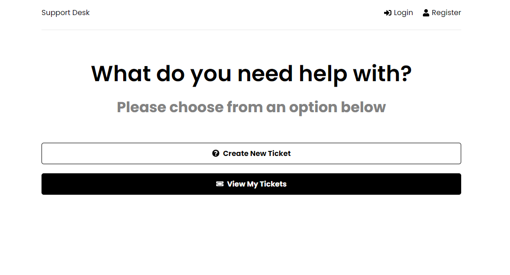
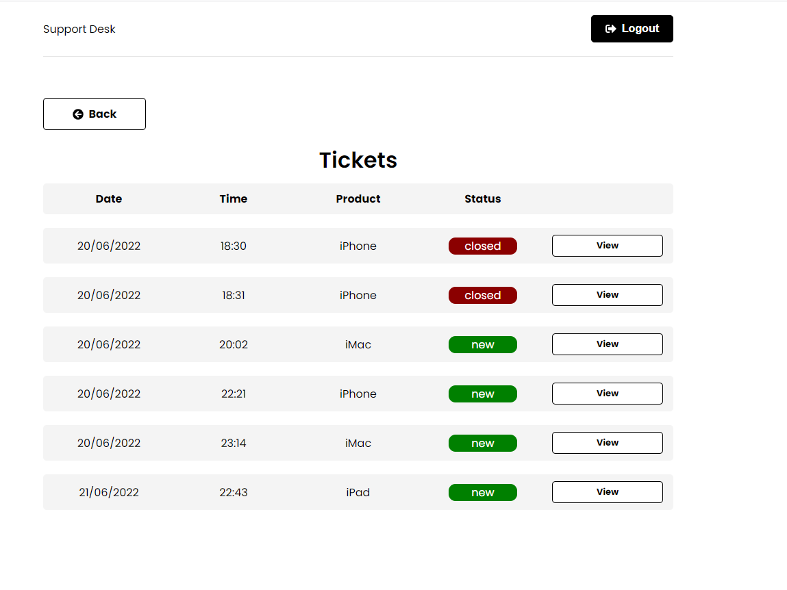
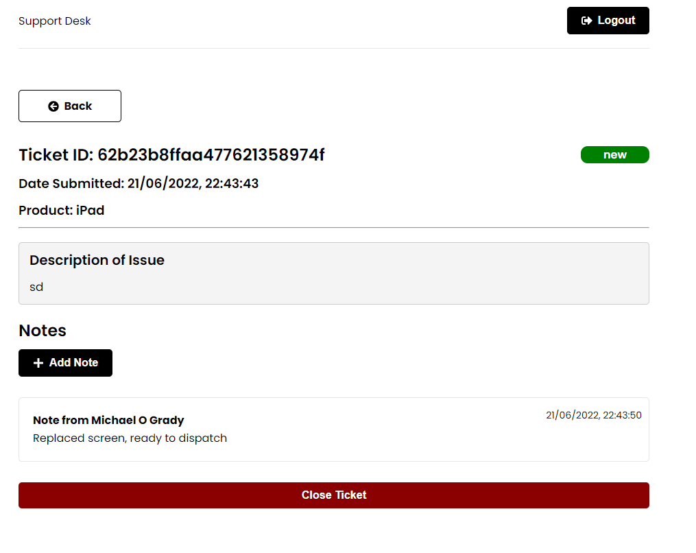

# Support Desk

<p align="center"></p>
<p align="center"></p>
<p align="center"></p>

# Table of Contents

- [Support Desk](#support-desk)
- [Table of Contents](#table-of-contents)
- [Project Details](#project-details)
- [Custom Hooks & Middleware](#custom-hooks--middleware)
- [Tools](#tools)
- [React](#react)
- [Mongoose](#mongoose)
- [MongoDB](#mongodb)
  - [MongoDB Atlas](#mongodb-atlas)
- [Redux and Redux Toolkit](#redux-and-redux-toolkit)
- [Packages](#packages)
  - [Backend](#backend)
  - [Frontend](#frontend)
- [Deployment on Heroku](#deployment-on-heroku)
- [Project Structure](#project-structure)

---

# Project Details

MERN Stack Application / MERN Stack Development

- [x] MERN Stack
  - [x] MongoDB
  - [x] Express
  - [x] React
  - [x] Node
- [x] Mongoose used as ODM
- [x] Deployed to Heroku
- [x] Backend API
- [x] Authentication
- [x] Redux for state management with Redux Toolkit
- [x] JSON Web Tokens
- [x] Frontend Form Validation
- [x] Backend Form Validation
- [x] React Modal for Adding Notes to Tickets

> Structure of the Application

- Frontend framework
  - React
- Backend framework
  - Express
  - Mongoose ODM Object Data Mapper
- JavaScript Runtime (for express)
  - Node.js

# Custom Hooks & Middleware

- useAuthStatus
- authMiddleware
- errorMiddleware

# Tools

- [x] Redux DevTools for Chrome (recommended) Allows you to see all actions as they happen and a overview of global state.
- [x] Postman - HTTP Client to test routes
- [x] MongoDB Compass - Desktop Console

# React

UI User Interface, requests made through react to react backend routes accessing the database etc.

# Mongoose

Mongoose is an ODM, an object data mapper and gives lot of easy to use functions to connect to the database to get data created which runs on through Express (server) which will have all the endpoints for the frontend to hit. i.e.

- Create ticket
- Delete ticket
- Log User In
- Register User

# MongoDB

## MongoDB Atlas

MongoDB Atlas, is basically just MongoDB in the cloud as opposed to being installed locally on your machine. It makes things a lot easier and is definitely recommended over a local installation.

# Redux and Redux Toolkit

Redux is a state manager and used to manage the app's global state by creating actions and sending data down to any components that require. So Redux is it's great for larger projects.

- [x] createSlice
- [x] createAsyncThunk

# Packages

## Backend

- [x] bcryptjs@2.4.3
- [x] colors@1.4.0
- [x] concurrently@7.2.2
- [x] dotenv@16.0.1
- [x] express-async-handler@1.2.0
- [x] express@4.18.1
- [x] jsonwebtoken@8.5.1
- [x] mongoose@6.3.8
- [x] nodemon@2.0.16

## Frontend

- [x] @reduxjs/toolkit@1.8.2
- [x] @testing-library/jest-dom@5.16.4
- [x] @testing-library/react@13.3.0
- [x] @testing-library/user-event@14.2.1
- [x] axios@0.27.2
- [x] react-dom@18.2.0
- [x] react-icons@4.4.0
- [x] react-modal@3.15.1
- [x] react-redux@8.0.2
- [x] react-router-dom@6.3.0
- [x] react-scripts@5.0.1
- [x] react-toastify@9.0.4
- [x] react@18.2.0
- [x] web-vitals@2.1.4

# Deployment on Heroku

This project is accessable via [https://support-desk-system.herokuapp.com/](https://support-desk-system.herokuapp.com/)

# Project Structure

```
support-desk
├── backend
│   ├── server.js
│   ├── config
|   |   └── db.js
│   ├── controllers
|   |   ├── noteController.js
|   |   ├── ticketController.js
|   |   └── userController.js
│   ├── middleware
|   |   ├── authMiddleware.js
|   |   └── errorMiddleware.js
│   ├── models
|   |   ├── noteModel.js
|   |   ├── ticketModel.js
|   |   └── userModel.js
│   └── routes
|       ├── noteRoutes.js
|       ├── ticketRoutes.js
|       └── userRoutes.js
├── frontend
│   ├── public
│   ├── src
|   |   ├── app
|   |   |   └── store.js
|   |   ├── components
|   |   |   ├── BackButton.jsx
|   |   |   ├── Header.jsx
|   |   |   ├── NoteItem.jsx
|   |   |   ├── PrivateRoute.jsx
|   |   |   ├── Spinner.jsx
|   |   |   └── TicketItem.jsx
|   |   ├── features
|   |   |   ├── auth
|   |   |   |   ├── authService.js
|   |   |   |   └── authSlice.js
|   |   |   ├── notes
|   |   |   |   ├── noteService.js
|   |   |   |   └── noteSlice.js
|   |   |   └── tickets
|   |   |       ├── ticketService.js
|   |   |       └── ticketSlice.js
|   |   ├── hooks
|   |   |   └── useAuthStatus.js
|   |   ├── pages
|   |   |   ├── Home.jsx
|   |   |   ├── Login.jsx
|   |   |   ├── NewTicket.jsx
|   |   |   ├── Register.jsx
|   |   |   ├── Ticket.jsx
|   |   |   └── Tickets.jsx
|   |   ├── App.js
|   |   ├── index.css
|   |   ├── index.js
|   |   └──  reportWebVitals.js
│   ├── .gitignore
|   ├── package.json
|   ├── package-lock.json
|   ├── node_modules
|   └── README.md
├── node_modules
|   └── ...
├── .env
├── package.json
└── package-lock.json
```
